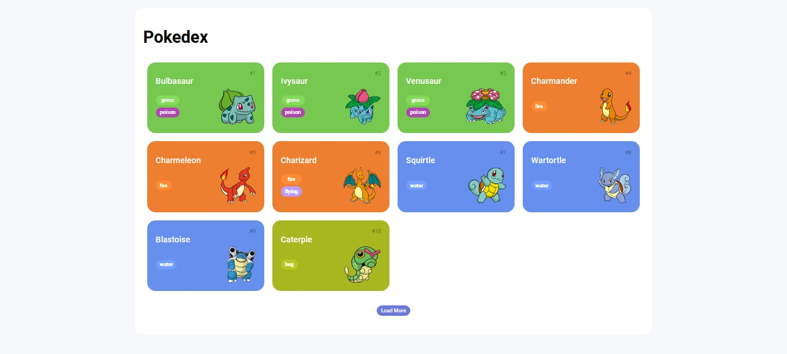

<h1 align="center"> 
Pokédex
</h1>

⚙️ Desenvolvimento de uma listagem de Pokemons (Pokédex) utilizando a PokeAPI. ⚙️

 

  

 

## 🛠 Tecnologias

Esse projeto foi desenvolvido com as seguintes tecnologias:

- **[HTML](https://developer.mozilla.org/pt-BR/docs/Web/HTML)**
- **[CSS](https://developer.mozilla.org/pt-BR/docs/Web/CSS)**
- **[Javascript](https://developer.mozilla.org/pt-BR/docs/Web/JavaScript)**
- **[Fetch API](https://developer.mozilla.org/pt-BR/docs/Web/API/Fetch_API)**
- **[Poke API](https://pokeapi.co/docs/v2#pokemon)**

 

## 🚀 Como Utilizar

- Faça o download do projeto base:  
  `https://github.com/digitalinnovationone/js-developer-pokedex.git`

- Utilize a extensão do live server:  
  `https://marketplace.visualstudio.com/items?itemName=ritwickdey.LiveServer`

- Faça a integração com a PokeAPI e realize suas modificações como preferir:  
  `https://pokeapi.co/docs/v2#pokemon` 

 

## 🔖 Layout

Você pode visualizar o layout do projeto através [DESSE LINK](https://dribbble.com/shots/6540871-Pokedex-App). 
Modelo retirado do site da [Dribbble](https://dribbble.com/search/pokedex-app)

 

## 📝 License

  

Esse projeto está sob a licença MIT.

 

### 👨‍💻 Autor

 
 <em>Ciro Batista da Silva<em>
 
  

 
👋🏽 Entre em contato!

 

